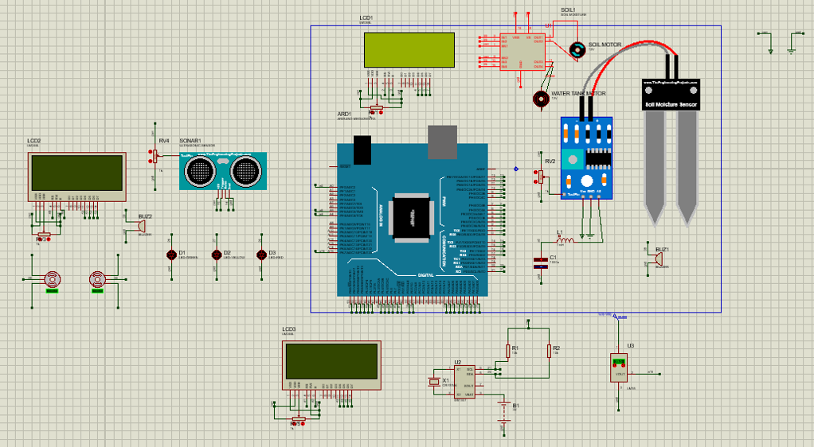
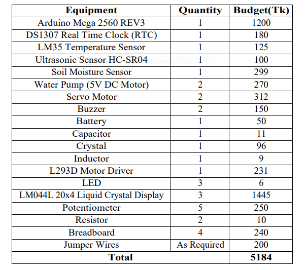

### Project Title:
Weather Station

### Description:
Weather warnings are important forecasts because they are used to protect life and property. The goal was to build a mini weather station where temperature, humidity, air pressure, raindrop, a warning will be captured and real-time will also be shown.

### Required Components
These following parts and tools are required for building this project

* Arduino Mega 2560 REV3
* DS1307 Real Time Clock (RTC)
* LM35 Temperature Sensor
* Ultrasonic Sensor HC-SR04
* Soil Moisture Sensor
* Water pump(5V DC Motor)
* Servo Motor
* Buzzer
* Battery
* Capacitor
* Crystal
* Inductor
* L293D Motor Driver
* LED
* LM044L 20x4 Liquid Crystal Display
* Potentiometer
* Resistor
* Breadboard
* Jumper Wires (Male to Male, Female to Female, Male to Female)

### Working Procedure:
The working procedure of the components that are used in this project:
* LM35 Temparature Sensor

To determine the Temperature, LM35 Temperature Sensor is used. It provides output 
voltage in Centigrade (Celsius).
* Real Time Clock (RTC)

To display the real-time date and updated date and time we have used a Real Time 
Clock (RTC).
* LM044L 20x4 Liquid Crystal Display

A Liquid Crystal Display is used to show the Temperature, Moist Content in soil and 
Water level. It shows the message of current status.
* Soil Moisture Sensor

Soil Moisture Sensor is used to measure the volumetric content of water. The two 
probes allow the current to pass through the soil and then it gets the resistance value to measure the moisture value.
* Ultrasonic Sensor HC-SR04

Ultrasonic Sensor is used to determine the water level in the tank. It uses SONAR to 
determine the distance of water level in tank.
* Motor-Driver

Motor Driver is used to control the working speed and direction of two motors called 
Soil Motor and Water Tank Motor simultaneously.
* Servo Motor

Servo Motor is a small device that has an output shaft. This shaft can be positioned to 
specific angular positions by sending the servo a coded signal. As long as the coded 
signal exists on the input line, the servo will maintain the angular position of the shaft.
* Potentiometer

Potentiometer is used to provide a variable resistance, which we read into the Arduino 
board as an analog value. By using potentiometer we see the changes of moist content 
in soil and water level in tank.
* Buzzer

Buzzer is used to alarm rings for the consequence of unwanted event. It is used to warn 
when the moisture level is decreased and the water level is decreased in an alarming 
way.
* LED

LED light is used to give signals. It is used to give signal when the distance percentage 
(while measuring water level in tank) is changed.

### Social Values
* It helps farmers and gardeners plan for irrigation and protection of crops.
* It helps increase production as the soil will have their 
proper moisture for the plants to grow which results in economic growth.
* Moisture-sensitive plants that were risky to cultivate before can be done easily with this system.
* Auto Water Pump system assists tiny fish businessmen to maintain a fixed amount of water in their pond, as fish may die from lack of water or too much water. Also, this system can be employed in residences for moving fresh water from the lower water tank to the top water tank for the proper amount.
* Alerting people about the motor’s condition.
* It helps people know outside weather temperature and acknowledge instant time.
* It can also be used in regular gardening or plant nurseries.

### Design:

### Estimated Budget

